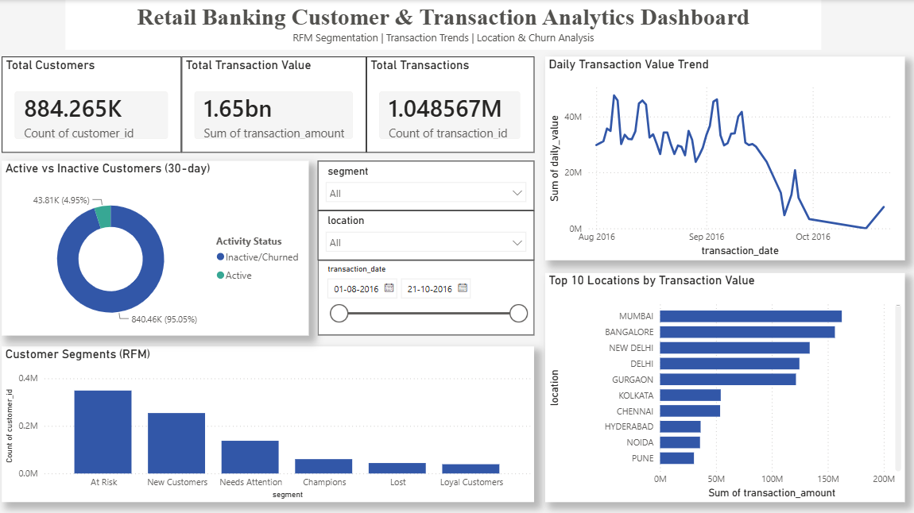
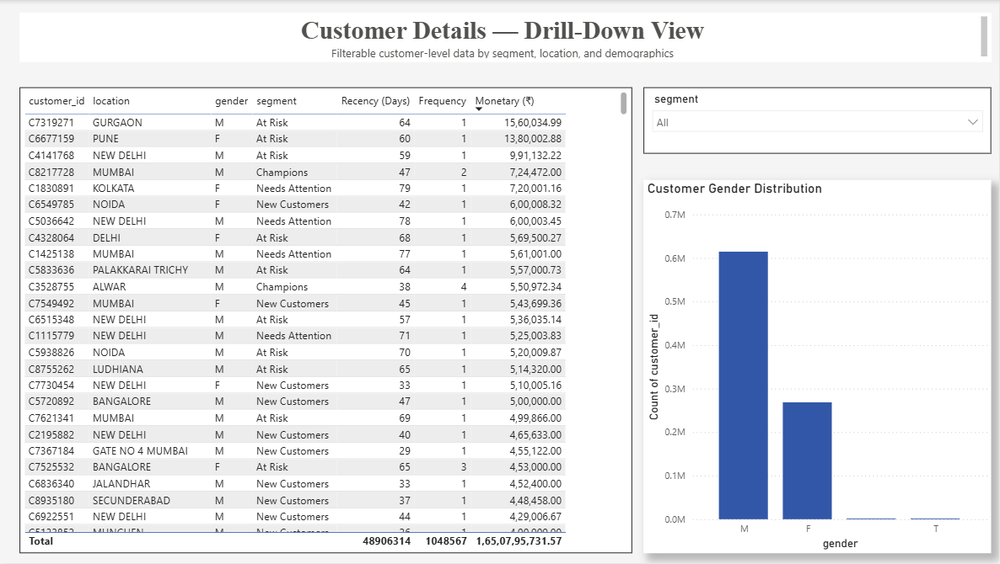

# Retail Banking Customer & Transaction Analytics

An end-to-end data analytics project built on a 1M+ row real-world Indian banking transaction dataset — from raw, messy CSV to a cleaned relational database, four SQL analysis modules, and an interactive two-page Power BI dashboard.

**Live dashboard screenshots:** see `/Screenshots`
**SQL scripts:** see `/SQL`
**Power BI file:** see `/Dashboard`

---

## Business Problem

A retail bank wants to understand its customer base better: who its most valuable customers are, how transaction activity trends over time, which locations drive the most business, and how many customers are at risk of churning. This project answers those questions using SQL for analysis and Power BI for visualization.

## Dataset

- **Source:** [Bank Customer Segmentation dataset, Kaggle](https://www.kaggle.com/datasets/shivamb/bank-customer-segmentation)
- **Size:** ~1,048,567 transaction records, spanning Aug 1 – Oct 21, 2016
- **Original format:** a single flat CSV combining customer and transaction data

## Tools Used

- **MySQL / MySQL Workbench** — data cleaning, transformation, and analysis
- **Power BI Desktop** — interactive dashboard, connected live to MySQL
- **SQL techniques:** window functions (`NTILE`, `AVG() OVER`), CTEs-equivalent logic, `REGEXP`-based data validation, `JOIN`s, `GROUP BY`/`HAVING`, defensive NULL handling
- **DAX** — one calculated column in Power BI for activity status

---

## Project Workflow

### 1. Data Cleaning & Schema Design (`01_schema_setup.sql`, `02_data_cleaning.sql`)

The raw CSV arrived as a single flat file with inconsistent formatting: mixed date formats, blank account balances, malformed decimal fields, and duplicate customer IDs. Rather than editing the source file, I:

- Loaded the raw data as-is into a staging table (`staging_bank_data`) with all-text columns, so no row would be rejected on import
- Validated and converted dates/decimals using `REGEXP` pattern matching, converting anything that didn't match a valid pattern to `NULL` instead of failing the load
- Deduplicated customers (~50K duplicate customer IDs existed with conflicting details) using `GROUP BY` + `MIN()` to pick one consistent value per customer
- Split the flat file into two normalized tables — `customers` and `transactions` — linked by a foreign key, with `account_balance` treated as a transaction-level snapshot rather than a fixed customer attribute, since it changes with each transaction

**Result:** 884,265 clean customer records, 1,048,567 clean transaction records, 0 data-loss during cleaning.

### 2. RFM Customer Segmentation (`03_rfm_segmentation.sql`)

Calculated **Recency, Frequency, and Monetary** value per customer, scored each dimension 1–5 using the `NTILE()` window function, then combined the three scores into six business-readable segments (Champions, Loyal Customers, At Risk, Needs Attention, New Customers, Lost).

**Key finding:** Champions make up only 6.8% of the customer base but spend nearly 3x the average customer — a clear target segment for retention investment.

### 3. Transaction Trends Over Time (`04_transaction_trends.sql`)

Built monthly and day-of-week rollups, plus a **7-day rolling average** using `AVG() OVER (ROWS BETWEEN 6 PRECEDING AND CURRENT ROW)` to smooth daily volatility and reveal the underlying trend.

**Key finding:** transaction volume shows a clear weekly cyclical pattern through August–September, followed by a sharp decline heading into October (partly attributable to the dataset's tail-end cutoff on Oct 21).

### 4. Location-Based Analysis (`05_location_analysis.sql`)

Joined `customers` and `transactions` to rank locations by transaction value and average balance, filtering out locations with fewer than 100 customers to avoid small-sample distortion skewing the results.

**Key finding:** Mumbai and Bangalore lead in transaction value; Shillong stands out with a disproportionately high average balance relative to its customer count.

### 5. Churn / Inactivity Analysis (`06_churn_analysis.sql`)

Bucketed customers into activity tiers based on recency of last transaction, using a 30-day threshold appropriate to the dataset's ~82-day span.

**Key finding:** 95.05% of customers had no transaction in the last 30 days of the observed window, representing over ₹155 crore in historical transaction value — a strong signal for a targeted re-engagement campaign.

---

## Dashboard

### Page 1 — Overview

Headline KPIs, RFM segment distribution, daily transaction trend, active vs. inactive customer split, and top 10 locations by transaction value — all cross-filterable by segment, location, and date range via slicers.

### Page 2 — Customer Details

A filterable, sortable customer-level table plus a gender breakdown chart, for drilling into individual segments or locations.

---

## What I'd Do Differently / Next Steps

- With more time, I'd extend the churn definition with a longer historical window, since 30 days is aggressive given the dataset only spans ~82 days
- The dataset's `account_balance` field showed a few zero/NULL values after cleaning — worth investigating the source data further for a production use case
- Next iteration: add a DAX-based dynamic "what-if" parameter for churn threshold, so the dashboard viewer can adjust the recency cutoff interactively

---

## About This Project

Built as a portfolio project to demonstrate SQL-first data analysis skills — from raw data cleaning through business-focused analytical modeling — paired with dashboard design in Power BI.

**Author:** Sneha Kadappa Timmavvagol
**LinkedIn:** [linkedin.com/in/sneha-timmavvagol](https://linkedin.com/in/sneha-timmavvagol)
